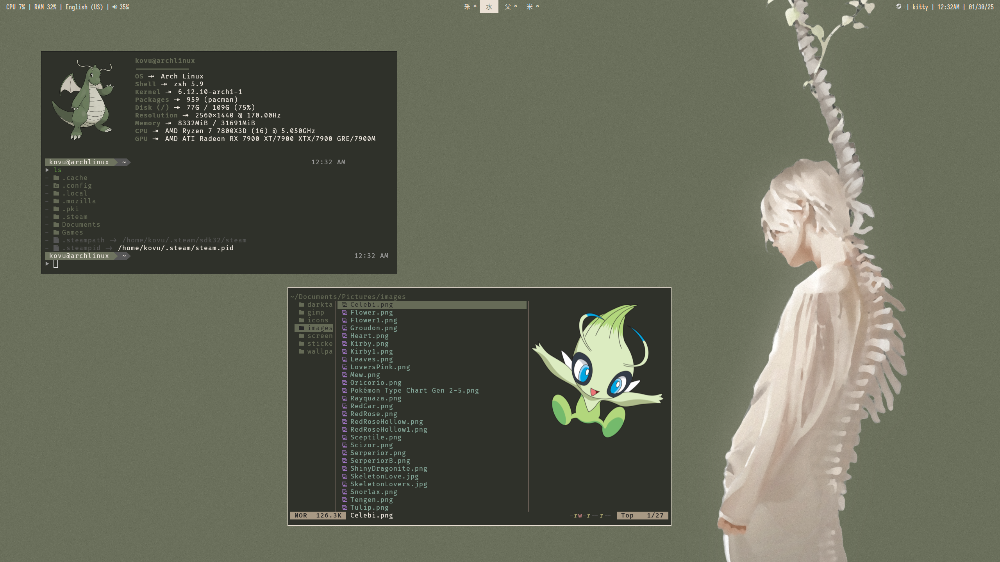
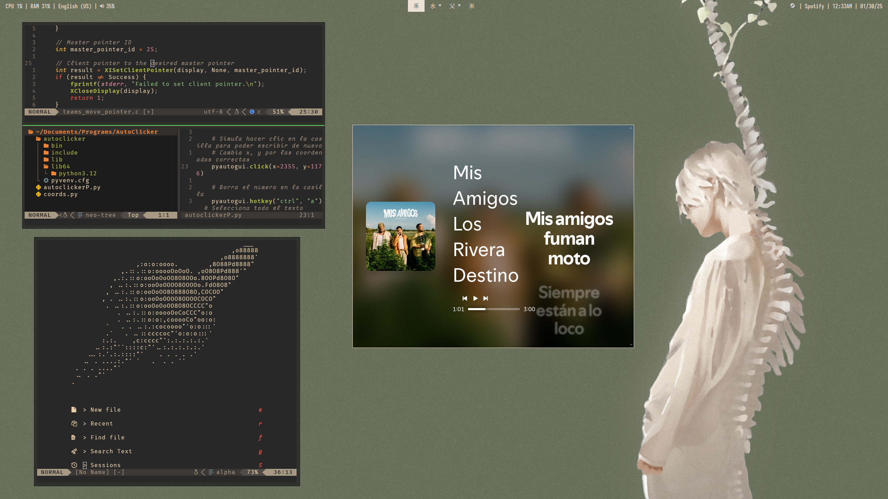

# Green Moss Dotfiles




## Included:

- `Prompt` - Custom prompt with functions and git integration
- `Dunst` - Notification daemon
- `Kitty` - Terminal emulator
- `Neofetch` - Config for reference
- `Picom` - Compositor
- `Polybar` - Status bar
- `Rofi` - Application launcher
- `Yazi` - File manager

## Installation

Clone the repository and manually copy/link the files.

```sh
git clone https://github.com/iikovu/dotfiles-green-moss.git
cd dotfiles-green-moss
```
